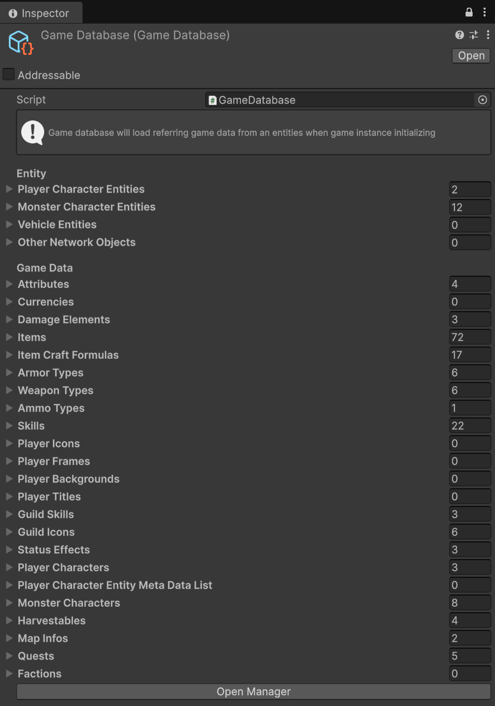
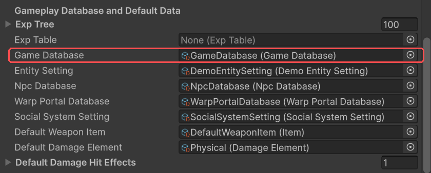
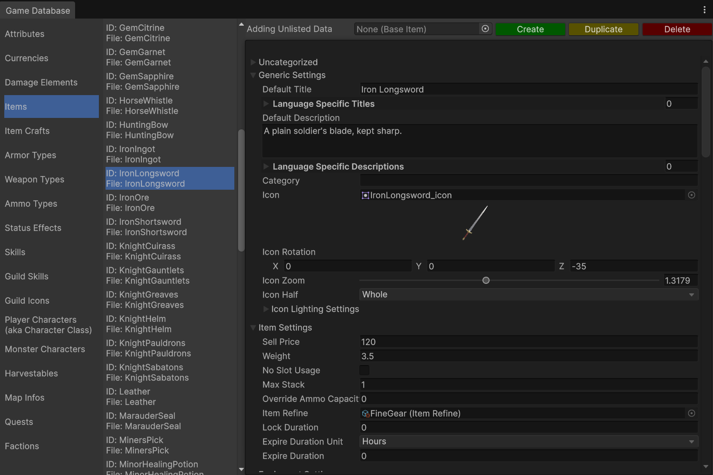

The **game database** is the list of everything your game is made of: the character
prefabs players control, the monsters, the items and skills, the maps, the quests. Clients
and servers look content up by ID, and only content that has been registered can be found.
An item that never reaches the database can't drop, can't be bought and can't be loaded from
a saved character.

## What goes in it

A game database has two kinds of entry.



**Entities** are the prefabs that appear in the world and are synchronised over the network:

| Entry | What it is |
| --- | --- |
| Player Character Entities | The character prefabs players control. |
| Monster Character Entities | Monster prefabs. |
| Vehicle Entities | Mounts and vehicles players can ride. |
| Other Network Objects | Any other networked prefab the game spawns. |

If your project uses Addressables, each list has an **Addressable** twin that holds asset
references instead of prefabs. See [Before you build](./before-you-build.md#addressables).

**Game data** are the ScriptableObject assets that describe your content:

| Entry | What it is |
| --- | --- |
| Attributes | Stats that stat points can raise, such as Strength or Vitality. |
| Currencies | Currencies other than gold. |
| Damage Elements | Kinds of damage, such as fire or poison, each with its own resistances. |
| Items | Every item, of every type. |
| Item Craft Formulas | Crafting recipes. |
| Armor Types, Weapon Types, Ammo Types | The categories items belong to. A weapon type decides how its weapons attack and which ammo they use; an armor type decides which slot it fills. |
| Skills | Character skills, active and passive. |
| Player Icons, Frames, Backgrounds, Titles | Profile cosmetics players can choose from. |
| Guild Skills, Guild Icons | Skills a guild can learn, and crests a guild can pick. |
| Status Effects | Buffs and debuffs that attacks and skills can apply. |
| Player Characters | The playable classes. |
| Player Character Entity Meta Data | A variant of a player character prefab: which classes are offered with it at character creation, and its race. |
| Monster Characters | Monster data: stats, skills, rewards and drops. |
| Harvestables | Resources such as trees and ore, and what they yield. |
| Map Infos | Each map scene a player can be on, with its rules. |
| Quests | Quests. |
| Factions | Sides players can choose, if your game has them. |

### Related data is added for you

You don't have to list everything by hand. When the game loads an entry, it also registers
the data that entry refers to. Registering a monster also registers its skills and the items
it drops. Registering a class also registers its attributes and the damage elements its
armour resists. Registering a character or monster prefab also registers its character
data, and with it everything above. In practice you register the top of each chain, and
the rest follows.

## Two kinds of game database

**Game Database** holds its lists in the asset itself. You add entries by dragging assets
into its fields, or with the [Game Database window](#the-game-database-window). It loads
exactly what you list, plus the related data, so you always know what's in the game.

- Create: in the **Project** window, right-click and choose **Create → Create GameDatabase → Game Database**.

**Resources Folder Game Database** has no lists. It loads every asset of each supported type
from any `Resources` folder in the project, so creating an asset in one of those folders is
enough to register it. That's convenient, but everything under `Resources` goes into every
build whether the game uses it or not.

- Create: **Create → Create GameDatabase → Resources Folder Game Database**.

The demo uses a **Game Database**:
`Assets/OpenMMORPG/Demo/GameData/GameDatabase.asset`.

## Choosing which database the game uses

Drag your database into the **Game Database** field of [Game Instance](./game-instance.md).
If you leave that field empty, the game falls back to loading game data from `Resources`
folders, the same way a Resources Folder Game Database does.



## The Game Database window

**Open MMORPG → Develop → Game Database** opens a window for managing a Game Database's
contents. When it opens, it asks which Game Database to edit. To switch to another one,
close the window and open it again. The **Open Manager** button at the bottom of a Game
Database's Inspector does the same thing for that database.



The left column lists kinds of data, the middle column lists the entries of the selected
kind by ID and file name, and the right side edits the selected entry in place. Along the
top:

- **Create** makes a new asset of the selected kind and adds it to the database.
- **Duplicate** copies the selected entry's asset and adds the copy.
- **Delete** removes the selected entry **and deletes its asset file** from the project.
- **Adding Unlisted Data** is for an asset that exists but isn't in the database yet. Drop
  it into that field, and an **Add** button appears.

The window covers the most common kinds of data, not every list. Edit the others, such as the
entities and the player icons, frames, backgrounds and titles, on the database asset in the
Inspector. The window works with **Game Database** assets only, because a Resources Folder
Game Database has no lists to manage.

## Writing your own game database

If neither kind suits you, for example because you want to load data from your own files or a
web service, write your own. Make a class that inherits from `BaseGameDatabase` and implement
`LoadDataImplement`. In it, register your data with the `GameInstance.Add...` methods:

```csharp
using Cysharp.Threading.Tasks;
using UnityEngine;

namespace MultiplayerARPG
{
    [CreateAssetMenu(fileName = "My Game Database", menuName = "Create GameDatabase/My Game Database")]
    public class MyGameDatabase : BaseGameDatabase
    {
        public BasePlayerCharacterEntity[] playerCharacterEntities;
        public BaseItem[] items;

        protected override UniTask LoadDataImplement(GameInstance gameInstance)
        {
            GameInstance.AddPlayerCharacterEntities(playerCharacterEntities);
            GameInstance.AddItems(items);
            return UniTask.CompletedTask;
        }
    }
}
```

`LoadDataImplement` returns a `UniTask`, so it can also be `async` and await data that
takes time to arrive.

There is an `Add...` method for every kind of entry, including:

- **Entities:** `AddPlayerCharacterEntities`, `AddMonsterCharacterEntities`,
  `AddVehicleEntities`, `AddOtherNetworkObjects`, plus `AddAssetReference...` versions of
  each for Addressables.
- **Game data:** `AddAttributes`, `AddCurrencies`, `AddDamageElements`, `AddItems`,
  `AddItemCraftFormulas`, `AddArmorTypes`, `AddWeaponTypes`, `AddAmmoTypes`, `AddSkills`,
  `AddPlayerIcons`, `AddPlayerFrames`, `AddPlayerBackgrounds`, `AddPlayerTitles`,
  `AddGuildSkills`, `AddGuildIcons`, `AddStatusEffects`, `AddCharacters` (for both player
  and monster characters), `AddPlayerCharacterEntityMetaDataList`, `AddHarvestables`,
  `AddMapInfos`, `AddQuests`, `AddFactions`, `AddNpcDialogs`, `AddEquipmentSets`.

Each `Add...` method also registers the related data of what it adds, the same way the
built-in databases do.
