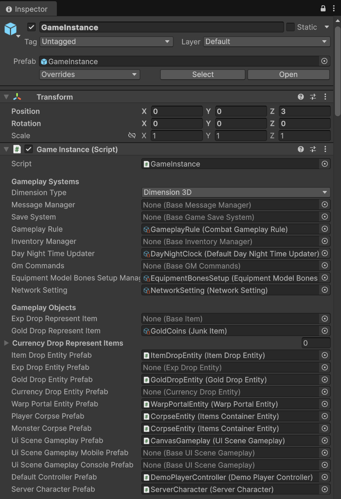
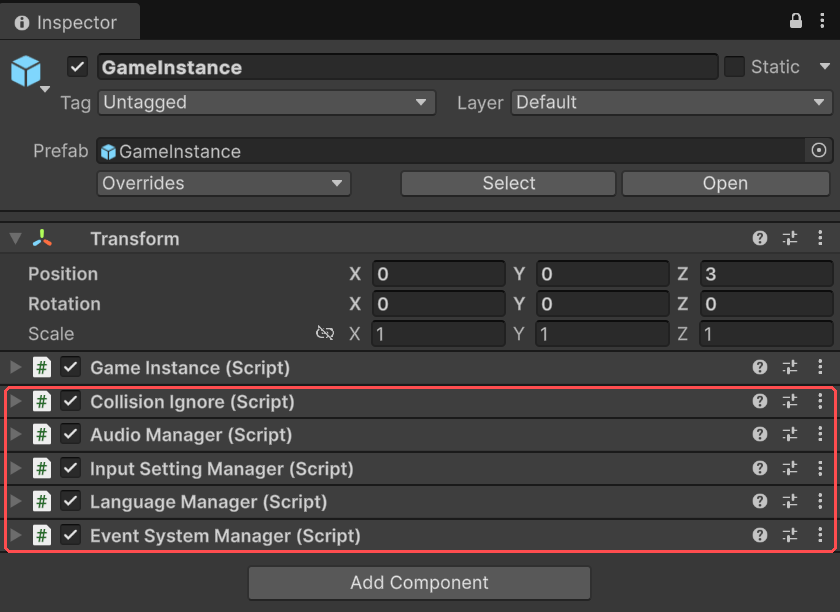
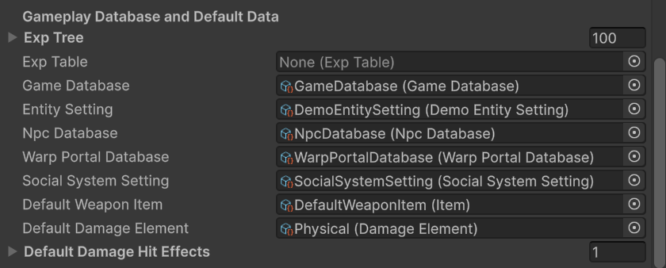

**Game Instance** is the component that holds your game's configuration. Nearly everything
that is true for the whole game, rather than for one character or one map, is set here or in
an asset it points to. That covers:

- which systems run: the gameplay rule, the save system, the day-night clock, GM commands;
- which objects the game spawns: dropped items, corpses, warp portals, the in-game UI and the
  player controller;
- where the game data comes from: the game database, the NPC and warp portal databases and
  the party and guild settings;
- fallbacks: the weapon a character fights with when nothing is equipped, and the damage
  element used when an attack doesn't name one;
- gameplay rules of thumb: how long dropped items last, who may loot them, how close a player
  must be to talk or pick something up, how the inventory works;
- what a new character starts with, and which scene is the home screen.

## Where to find it

There is one Game Instance per game. It lives in your first scene, and it carries on
through every scene the game loads after that. In the demo it is the prefab
`Assets/OpenMMORPG/Demo/Prefabs/GameInstance.prefab`, placed in the `00Init` scene. Open the
prefab to see the demo's configuration.

Every field has a tooltip: hover over a field's name in the Inspector to read what it does.
This page explains what each section is *for*, so you know where to look; the tooltips cover
the detail.

## What's in it

| Section | What it sets |
| --- | --- |
| **Gameplay Systems** | Pluggable systems, each an asset: message manager, save system, gameplay rule, inventory manager, day-night time updater, GM commands, equipment bone setup, network setting. |
| **Gameplay Objects** | Prefabs the game spawns for you: item, gold and currency drops, warp portals, player and monster corpses, the gameplay UI (one each for PC, mobile and console), the default player controller and the server's camera. |
| **Character Objects** | Objects attached to every player, monster or NPC when it appears, for example markers on the minimap. |
| **Character UIs** | The floating name and health bars over characters, and the quest marker over NPCs. |
| **Gameplay Effects** | Effects for level-ups and for being stunned, muted or frozen. |
| **Gameplay Database and Default Data** | The experience table, the game database, the entity setting, the NPC and warp portal databases, the party and guild settings, the default weapon, the default damage element and the default hit effect. |
| **Object Tags and Layers** | The tags and layers given to players, monsters, NPCs, vehicles, dropped items, buildings and harvestables, and the layers that block attacks. |
| **Gameplay Configs** | Item lifetimes and loot locks, party sharing, trading, vending and duelling, interaction distances, inventory and storage rules, summons, pets and instance dungeons. |
| **New Character** | Gold and items a new character starts with, or a New Character Setting asset that decides them. |
| **Server Settings** | Whether the server plays character animations itself. |
| **Player Configs** | Name length limits, and how many characters an account may have. |
| **Platforms Configs** | The frame rate a server runs at. |
| **Playing In Editor** | How the game starts when you press Play in the editor. |
| **Home Scene** | The scene used to log in and pick a character, with separate ones for mobile and console if you need them. |

## Helper components

The demo's Game Instance object carries a few more components next to the Game Instance itself.
None of them is required, but each handles one job most games need:

- **Audio Manager** keeps the master, music, sound-effect and ambient volume settings, and any
  others you add.
- **Collision Ignore** switches off collisions between pairs of layers when the game starts.
  The demo uses it so characters can walk through each other and through dropped items.
- **Input Setting Manager** holds the key bindings. The demo's controls are set here, and
  they override Unity's own input settings.
- **Language Manager** manages translations of the game's text.
- **Event System Manager** keeps track of the UI's event system as scenes load.

## The assets it points to

Most sections of Game Instance point to an asset rather than holding values themselves.
That keeps settings you might swap, such as a different gameplay rule for a test server,
in their own files. Each asset is created from the **Project** window: right-click, choose
**Create**, then the menu shown below. Drag the new asset into its Game Instance field to
use it.

### Gameplay Rule

The gameplay rule decides the numbers behind combat and progression. In its fields: how many
stat and skill points each level gives, how much experience a death costs, health and mana
regeneration, hunger and thirst, movement speed while sprinting, walking, swimming or
overweight, and how fast equipment wears down. In its code: the formulas for damage, hit
chance and critical hits.

- Create: **Create GameplayRule → Default Gameplay Rule**
- Field: **Gameplay Rule**

The default rule is meant to be extended. The demo uses its own rule, `CombatGameplayRule`,
which builds on the default one to tune the demo's combat.

### Game Database

The game database is where characters, monsters, items, skills, quests, maps and the rest of
the game's content are registered. It has a page of its own: [Game Database](./game-database.md).

- Field: **Game Database**

### Entity Setting

Decides which optional components each player, monster, harvestable, building and vehicle
gets when it appears. The default one has a switch for each player feature: ladders,
building, crafting, trading, duelling, vending and player-versus-player combat. Turn one off
and players simply don't have that feature. Leave the field empty to use the default
setting with every feature on.

- Create: **Create Entity Setting → Default Entity Setting**
- Field: **Entity Setting**

The demo uses its own entity setting, `DemoEntitySetting`, which builds on the default one
to add the demo's own components to characters as they appear.

### NPC Database

A list of NPCs to place on each map, with their positions and dialogs. You can also put NPCs
straight into a map scene instead. If you only ever do that, leave the field empty.

- Create: **Create GameDatabase → Npc Database**
- Field: **Npc Database**

### Warp Portal Database

A list of warp portals for each map: where the portal stands, and where it takes a player.
As with NPCs, you can place warp portals straight into a map scene instead and leave the
field empty.

- Create: **Create GameDatabase → Warp Portal Database**
- Field: **Warp Portal Database**

### Social System Setting

The rules for parties and guilds: how many members each may have, who may invite and remove
members, what it costs to found a guild, the guild's member roles, and the experience its
levels take. Leave the field empty to use the defaults.

- Create: **Create GameData → Social System Setting**
- Field: **Social System Setting**

### Experience table

How much experience each level takes. An **Exp Table** asset can calculate the whole table
for you from a maximum level and a curve: set them and press **Calculate Exp**.

- Create: **Create GameData → Exp Table**

The older **Exp Tree** list, set directly on Game Instance, still works, but it is on its way
out; use an Exp Table for new projects.

### New Character Setting

The gold and items every new character starts with, kept in an asset so you can swap the
whole starting kit at once. When this field is empty, the game uses the **Start Gold** and
**Start Items** fields on Game Instance instead.

- Create: **Create GameData → New Character Setting**
- Field: **New Character Setting**

### Gameplay UI

The in-game interface is a single prefab, the gameplay UI. Set it in **UI Scene Gameplay
Prefab**. The demo's is `Assets/OpenMMORPG/Demo/Prefabs/UI/CanvasGameplay.prefab`. To make
your own, duplicate the demo's, change the copy, and set the copy here. The mobile and console
fields are optional. When they're empty, every platform uses the PC prefab.

### Home scene

The home scene is where players log in and create and choose characters. The demo's is
`01Home`. Set your own in **Home Scene**, with optional separate versions for mobile and
console players.
