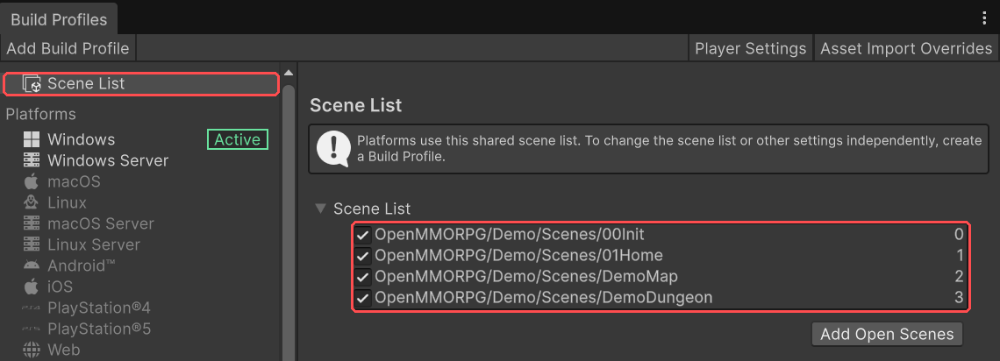
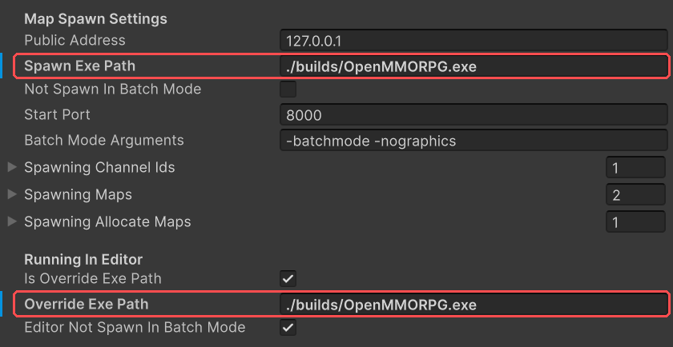
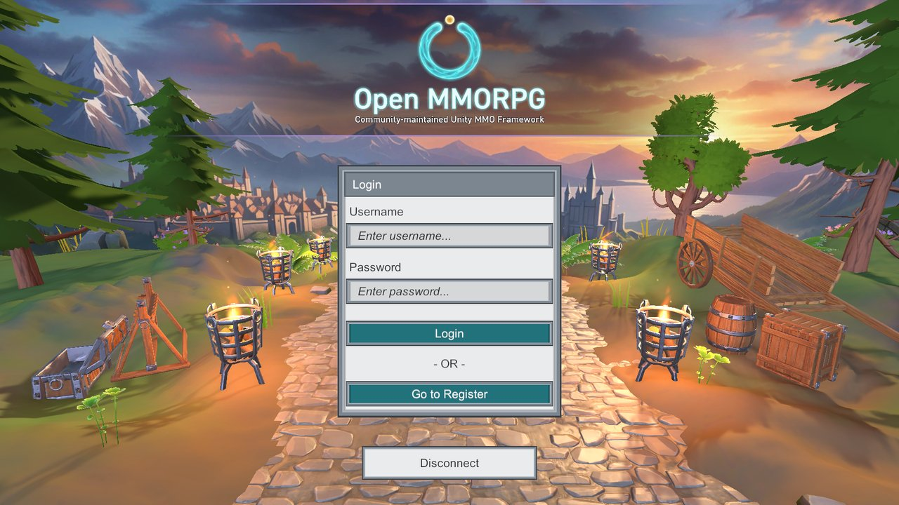
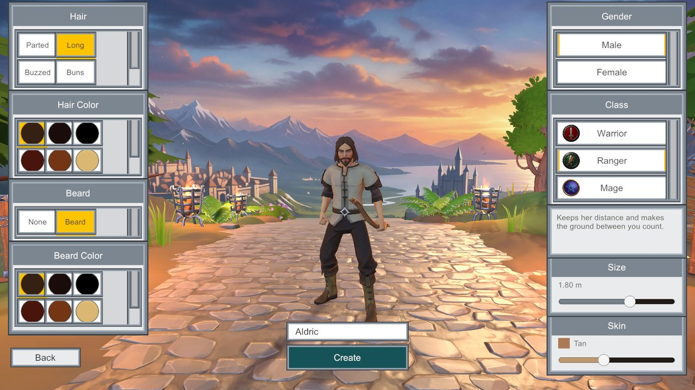
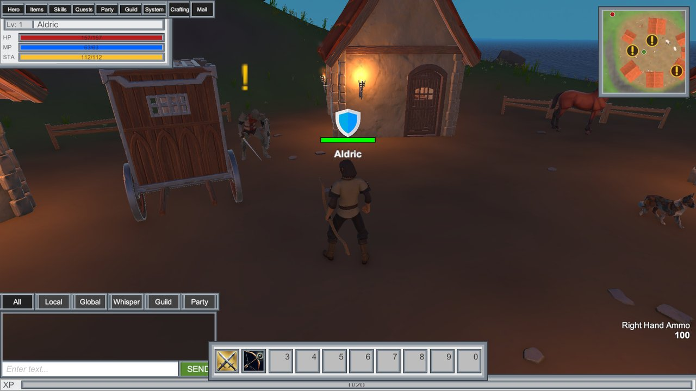

This page takes you from an empty Unity project to walking around the demo island with a
character you made yourself. Most of the time it takes is Unity importing and building.

## What you need

- **Unity 6000.3** (Unity 6.3 LTS) or newer.
- **Windows**, for the steps exactly as written. The kit also runs on macOS and Linux; the
  only difference is where the map server build goes, covered in
  [Running on macOS or Linux](#running-on-macos-or-linux).

## 1. Create a project

In Unity Hub, create a new project from the **Universal 3D** template.

Open MMORPG renders with the Universal Render Pipeline (URP). Importing the kit into a project
made from another template still works, because the import adds URP for you, but the kit's
graphics settings assume a URP project, so starting from Universal 3D saves you a round of fixes.

## 2. Import the kit

Get the kit from either of these:

- **Unity Asset Store.** Open **Window → Package Manager**, select **My Assets**, find
  Open MMORPG, then choose **Download** and **Import**.
- **GitHub.** Download `OpenMMORPG.unitypackage` from the
  [latest release](https://github.com/open-mmorpg/OpenMMORPG/releases/latest), then choose
  **Assets → Import Package → Custom Package...** in Unity and pick the file.

Unity first tells you the package has Package Manager dependencies. Choose **Install/Upgrade**.
This adds the Unity packages the kit is built on: URP, the Input System, Addressables, Burst
and a few others. The import window then lists the kit's files. Leave everything ticked and
choose **Import**.

Everything lands in `Assets/OpenMMORPG`. Keep your own work outside that folder, so that
[updating the kit](./updating.md) can never overwrite it.

## 3. Import the project settings

The kit expects particular input axes, physics settings, tags, layers and quality levels.
Choose **Open MMORPG → Install → Import Project Settings**. The dialog names the files it
replaces:

- `ProjectSettings/DynamicsManager.asset`
- `ProjectSettings/InputManager.asset`
- `ProjectSettings/ProjectSettings.asset`
- `ProjectSettings/QualitySettings.asset`
- `ProjectSettings/TagManager.asset`
- `ProjectSettings/TimeManager.asset`

Choose **Import Settings**, then **Import** in the window Unity shows next.

> **Do this on a new project.** Those six files are replaced outright, so any input, layer,
> tag or quality changes you had made yourself are lost.

## 4. Meet the demo

The demo lives in `Assets/OpenMMORPG/Demo`. It is a small island with a village, three enemy
families, wildlife, a rideable horse and a dungeon. It has three classes (Warrior, Ranger and
Mage), quests, harvesting, crafting and an inn. Its four scenes, in the order the game uses them:

| Scene | What it does |
| --- | --- |
| `00Init` | Starts everything. In the editor it also starts the servers. Always the first scene. |
| `01Home` | Login, channel choice, and character creation and selection. |
| `DemoMap` | The island, Verdant Isle. |
| `DemoDungeon` | The Cultist Crypt, reached through the crypt door in the hills. |

## 5. Add the scenes to the build

For the Verdant Isle demo, the demo build profile already contains the required scenes. If you want to check them or add your own scenes, open **File → Build Profiles** and select **Scene List** at the top left. Drag the scenes from `Assets/OpenMMORPG/Demo/Scenes` into the list, and make sure `00Init` is at the top. The game always starts from the first scene in the list.

## 6. Build the map server

Open MMORPG is an MMO framework, and the demo runs the way a live game does: as several servers working together. When you press Play on `00Init`, the editor starts the login, central, database and map-spawn servers, and then the game client. Every map runs as an independent server process of its own, launched by the map-spawn server from a compiled binary of your project located at `builds/OpenMMORPG.exe`.

### One-Click Demo Build

Building the demo map server is completely automated:

1. In the top menu, choose **Open MMORPG → Demo → Build Demo Map Server** (or open **Open MMORPG → Demo → Welcome** and click **Build Demo Map Server**).
2. Unity will automatically compile the demo scenes directly into `builds/OpenMMORPG.exe`.

You do not need to switch build platforms, configure build profiles, or manually create folders.

> **Rebuild after making game changes:** The map server is a compiled snapshot of your project. If you modify character classes, monsters, items, or map scenes, rebuild the map server by choosing **Build Demo Map Server** again. Otherwise the editor client and map server will disagree on game data and reject connections.

---

### Building for Custom Projects

When you move beyond the demo to build your own game:

1. **Scene List**: Ensure your own initialization and map scenes are added to **File → Build Profiles** or your custom Build Profile.
2. **Executable Paths**: On the **MapSpawnNetworkManager** component in your initialization scene (a child of `MMOServerInstance` in `00Init`):
   * **Override Exe Path**: The path to the map server binary launched while testing in the Unity Editor (defaults to `./builds/OpenMMORPG.exe`).
   * **Spawn Exe Path**: The path to the map server binary launched by dedicated standalone server builds.
3. **Dedicated Server Profiles**: In **File → Build Profiles**, select **Windows Server** or **Linux Server** to build headless server binaries with the `DISABLE_ADDRESSABLES` define (see [Server Configuration & CLI](../mmo/server-configuration-and-cli.md)).

## 7. Play

Open `Assets/OpenMMORPG/Demo/Scenes/00Init` and press **Play**.

1. **Pick a server.** The list has one entry, **Local Server**: the servers your editor just
   started. Select it and choose **Connect**.
2. **Make an account.** Choose **Go to Register**, enter any username and password, and
   choose **Register**. Then choose **Go to Login** and log in with them. Accounts and
   characters are saved in a local SQLite database, `mmorpgtemplate.sqlite3`, in your
   project folder.
3. **Pick a channel** and choose **Select**.
4. **Create a character.** Choose **Create**, then pick a gender and a class (Warrior,
   Ranger or Mage), set the size and skin tone, choose a hairstyle, a beard and their
   colours, and type a name. Choose **Create** again to save the character.
5. **Start.** Select your character and choose **Start Game**. The map-spawn server
   launches a map server for each of the demo's two maps, each in a window of its own, and
   the client joins the island a few seconds later. Leave those windows open. They close
   when you stop playing.

## Controls

The demo uses the controls most MMO players already know.

| Input | Action |
| --- | --- |
| W A S D | Move, relative to the camera |
| Drag with either mouse button | Orbit the camera (a right-button drag also turns your character) |
| Mouse wheel | Zoom, from first person out to fourteen metres |
| Left click | Target a character |
| Right click on an enemy | Target it and attack |
| Tab | Target the nearest enemy, and cycle through nearby ones |
| T | Attack your target, or the nearest enemy |
| 1 – 0 | Use what is on the action bar |
| E | Talk to an NPC, or use a door, chest or other object |
| F | Pick up an item |
| Space | Jump |
| Left Shift (hold) | Sprint |
| V | Get off your mount |
| C / B / P / L | Character, bags, skills, quests |
| O / J | Friends, guild |
| Esc | Cancel a ground-targeted skill you are aiming; otherwise open the game menu |

Drag skills from the skills window, or items from your bags, onto the action bar to use
them with the number keys. There is no click-to-move: walk up to NPCs, loot and
harvestables, and press **E** or **F**.

## Levelling up

Defeating enemies earns experience, and each level brings skill points to spend in the
skills window (**P**). Each class has four fighting skills, a passive and a toggle, unlocked
at different levels. Your class raises your attributes automatically as you level:

- **Strength** adds to weapon damage and to how much you can carry.
- **Dexterity** improves your accuracy, evasion and attack speed.
- **Vitality** raises your maximum health.
- **Intelligence** raises your mana and the power of your spells.

## Playing with a second player

The editor can host the game for a second player. Build a plain **Windows** player (not
the server) into any folder except `builds`, for example `builds_client`, and run it
while Play is running in the editor. With no arguments a player build starts no servers
of its own, so it connects to the servers in your editor.

## Running on macOS or Linux

Build the map server with **Linux Server** or **macOS Server** instead, then point
**Override Exe Path** on the `00Init` **MapSpawnNetworkManager** at the executable. On
macOS that is the binary inside the app bundle, for example
`builds/OpenMMORPG.app/Contents/MacOS/OpenMMORPG`.

## Next steps

- [Game Instance](./game-instance.md): the component that holds the game's configuration.
- [Game Database](./game-database.md): where your characters, items, skills and maps are registered.
- [Before you build](./before-you-build.md): build settings for offline, client and server builds.
